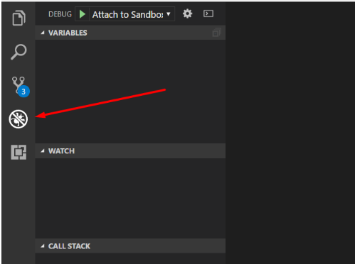
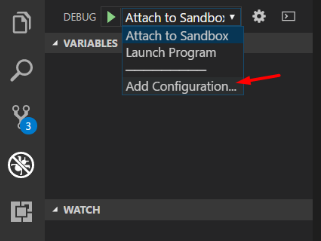
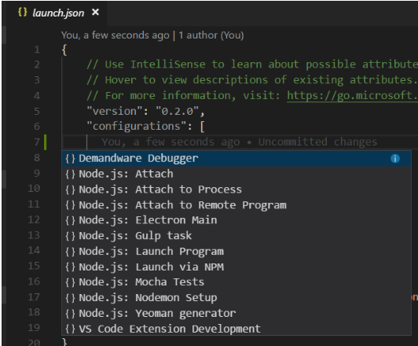
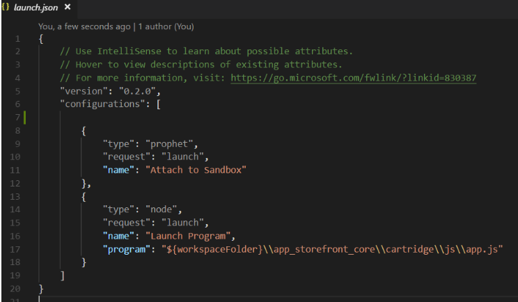
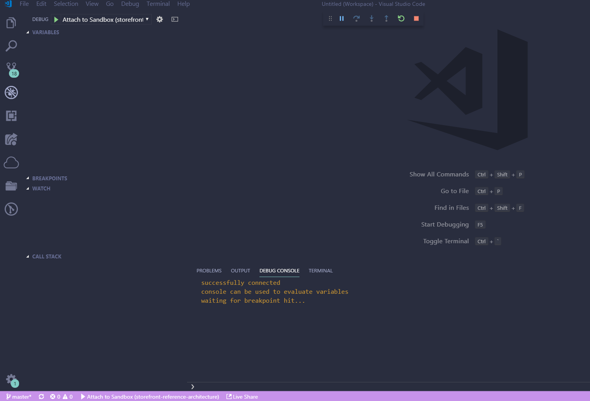
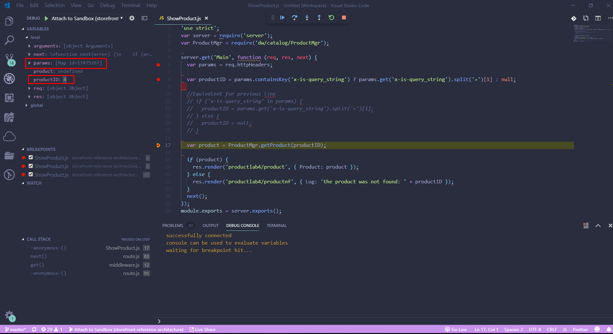
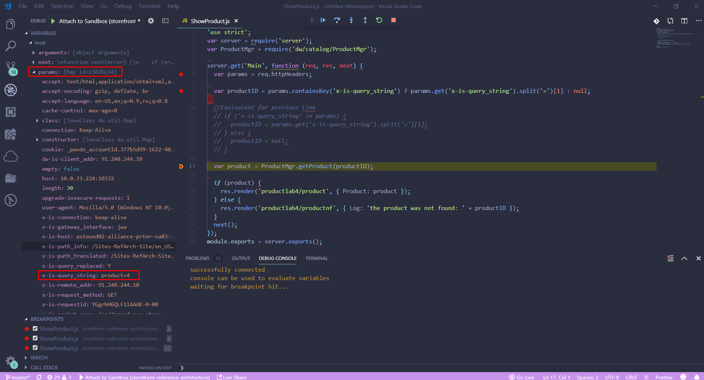

# SFRA Labs

**Table of context:**
- [SFRA Labs](#SFRA-Labs)
  - [Setting Up and Installing SFRA](#Setting-Up-and-Installing-SFRA)
  - [Configure DwithEasy Extension for Chrome](#Configure-DwithEasy-Extension-for-Chrome)
  - [Storefront Reference Architecture - SFRA](#Storefront-Reference-Architecture---SFRA)
  - [Global Development Strategy for SFRA Projects - WIP](#Global-Development-Strategy-for-SFRA-Projects---WIP)
  - [Developing with Commerce Cloud Storefront Reference Architecture](#Developing-with-Commerce-Cloud-Storefront-Reference-Architecture)
  - [Storefront Reference Architecture - Technical Deep Dive:](#Storefront-Reference-Architecture---Technical-Deep-Dive)
  - [Lab1: Creating the Hello Controller](#Lab1-Creating-the-Hello-Controller)
  - [Lab2: Finding an Error on a Controller](#Lab2-Finding-an-Error-on-a-Controller)
  - [Lab3: Using the Controller Debugger](#Lab3-Using-the-Controller-Debugger)
  - [Lab4: Templates](#Lab4-Templates)
  - [Lab5: Script Debugging](#Lab5-Script-Debugging)
  - [Lab6: Reusing Code with a Decorator](#Lab6-Reusing-Code-with-a-Decorator)
  - [Lab6: Reusing Code with a Local Include](#Lab6-Reusing-Code-with-a-Local-Include)
  - [Lab7: Creating Social Networks Links](#Lab7-Creating-Social-Networks-Links)
  - [Lab8: Using Page Level Caching](#Lab8-Using-Page-Level-Caching)
  - [Lab9: SFRA Forms](#Lab9-SFRA-Forms)

## Setting Up and Installing SFRA

The SFRA (Storefront Reference Architecture) reference application provides two sample sites:

- RefArch
- RefArchGlobal

SFRA also provides associated data and code to drive the sample ecommerce storefront.

The SFRA reference application represents Commerce Cloud's current recommended approach for implementing digital storefronts. If you're creating a site, use the SFRA reference application as a starting point.

To get started with SFRA, you have to perform some preliminary steps:

- [Obtain a GitHub account if you don't already have one](https://documentation.b2c.commercecloud.salesforce.com/DOC1/index.jsp?topic=%2Fcom.demandware.dochelp%2FSFRA%2FSFRASetup.html)
- [Build SFRA and push the code to the server](https://documentation.b2c.commercecloud.salesforce.com/DOC1/index.jsp?topic=%2Fcom.demandware.dochelp%2FSFRA%2FBuildingSFRA.html)
- [Uploading Code for SFRA](https://documentation.b2c.commercecloud.salesforce.com/DOC1/index.jsp?topic=/com.demandware.dochelp/SFRA/ConfiguringSFRA.html)
- [Configure SFRA for your instance so that you can see products and catalogs on the sample storefront](https://documentation.b2c.commercecloud.salesforce.com/DOC1/index.jsp?topic=%2Fcom.demandware.dochelp%2FSFRA%2FConfiguringSFRA.html)


After your environment is set up, you can run the SFRA reference application and explore how it is constructed.


## Configure DwithEasy Extension for Chrome

1. Follow this [link](https://forkpoint.com/products/dwithease/) and click "ADD TO GOOGLE CHROME" button to install extension.
2. 
3. 
4. 
5. Fill the form and click Save
   
6. Now you can navigate to your Chrome extnesions, find the DWithEasy logo and work with your sandbox.


## Storefront Reference Architecture - SFRA
[Learn more](https://confluence.ontrq.com/display/ACDC/Storefront+Reference+Architecture+-+SFRA)

## Global Development Strategy for SFRA Projects - WIP

[Learn more](https://confluence.ontrq.com/pages/viewpage.action?spaceKey=ACDC&title=Global+Development+Strategy+for+SFRA+Projects+-+WIP#GlobalDevelopmentStrategyforSFRAProjects-WIP-res)

## Developing with Commerce Cloud Storefront Reference Architecture

[Watch Video](https://demandwaretraining.docebosaas.com/learn/course/91/Developing%2520with%2520Commerce%2520Cloud%2520Storefront%2520Reference%2520Architecture)

## Storefront Reference Architecture - Technical Deep Dive:
[Watch Video](http://salesforce.vidyard.com/watch/ehBFfZBd2PxcbaivjMJHE5)****


## Lab1: Creating the Hello Controller

**1. Create Hello.js controller**

Navigate to your custom cartridge (in my case it's "*app_custom_storefront*") and create *Hello.js* controller.

- *your_cartridge_name/cartridge/controllers/Hello.js*

```javascript
'use strict';

var server = require('server');


server.get('Show', function (req, res, next) {
    res.render('hello/helloTemplate');
    next();
});

module.exports = server.exports();
```

**2. Create template helloTemplate.isml**

Navigate to *your_cartridge_name/cartridge/templates/dafault/hello* folder and create helloTemplate.isml file.

- *your_cartridge_name/cartridge/templates/dafault/hello/helloTemplate*

```html
<html>
    <head>
        <title>Hello</title>
    </head>
    <body>
        <h1>Hello World!</h1>
    </body>
</html>
```

**3. Check your endpoint in browser**

Go to *https://your-sandbox-name-dw.demandware.net/on/demandware.store/Sites-RefArch-Site/en_US/Hello-Show* in your browser. And check or it works.
**Do not forget to change url with your sandbox name**

**4. If all works commit and push it to your branch**


## Lab2: Finding an Error on a Controller

If you had any problems in [Lab1](#Lab1-Creating-the-Hello-Controller) you can figure it out in two ways: using the Request Log or the Problem View.

**1. Use the Request Log:**
   1. Using the URL you bookmarked, invoke the Hello controller with a missing start node: *https://your-sandbox-name-dw.demandware.net/on/demandware.store/Sites-RefArch-Site/en_US/Hello-Show*
   2. Verify that an error occurs on the [storefront](https://documentation.b2c.commercecloud.salesforce.com/DOC1/index.jsp?topic=%2Fcom.demandware.dochelp%2FSiteDevelopment%2FViewStorefront.html&cp=0_1_6_8).
   3. Mouse-over the upper-left corner of the page to re-enable [the Storefront Toolkit](https://documentation.b2c.commercecloud.salesforce.com/DOC1/index.jsp?topic=%2Fcom.demandware.dochelp%2FStorefrontToolkit%2FStorefrontToolkit.html&resultof=%22Storefront%22%20%22storefront%22%20%22Toolkit%22%20%22toolkit%22%20).
   4. From the toolkit, select [Request Log](https://documentation.b2c.commercecloud.salesforce.com/DOC1/index.jsp?topic=%2Fcom.demandware.dochelp%2FSTReference%2FRequestlogtool.html&resultof=%22Request%22%20%22request%22%20%22Log%22%20%22log%22%20).
   5. Re-login to Business Manager if required and reopen the request log.
   6. Read the request log to find the error message.
   7. Correct the controller invocation (Hello-World) and refresh the page.
   8. In the browser, retest the Hello-World Controller.
   9. Use the Request Log to determine what error occurs.
   10. Correct the error and retest.


**2. Use the Problem View**
   1. Remove the interaction node from the controller.
   2. Look in the Problems view in the Controller Editor.
   3. Fix the error.
   4. Retest the Hello-World controller to make sure it works.


## Lab3: Using the Controller Debugger

This lab is about using debugger to debug controller execution. For this you need to create a controller, which gets the product by its ID, to create a Debug Configuration, start a Debugging Session and troubleshoot Debug Sessions. Please keep in mind, that described below debugger will work only for backend controllers, but not for frontend JS components.

**Important:** Please keep in mind that leaving debugger session idle for a long time could cause your Sandbox getting freezed.

**1. Get a Product using a Controller.**
   1. Save the *Hello* controller as *ShowProduct*.

   2. Use  *getProduct* method of *ProductMgr* to get product by it's ID, use the code below as an example. Please pay attention, that the controller expects productID to be passed as an url parameter. You could also notice that the controller renders two templates, which you didn't do so far - skip this detail for now, it will be explained in the next walkthrough.

```javascript
'use strict';
var server = require('server');
var ProductMgr = require('dw/catalog/ProductMgr');

server.get('Main', function (req, res, next) {
  var params = req.httpHeaders;

  var productID = params.containsKey('x-is-query_string') ? params.get('x-is-query_string').split('=')[1] : null;

  //Equivalent for previous line
  // if ('x-is-query_string' in params) {
  //   productID = params.get('x-is-query_string').split('=')[1];
  // } else {
  //   productID = null;
  // }

  var product = ProductMgr.getProduct(productID);

  if (product) {
    res.render('productlab4/product', { Product: product });
  } else {
    res.render('productlab4/productnf', { Log: 'the product was not found: ' + productID });
  }
  next();
});
module.exports = server.exports();
```

**2. Create Debug Configuration**

1. Go to Debugger tab (Ctrl + Shift + D)

    

2. In the dropdown list at the top choose "Add configuration":
    

3. Right after launch.json should be automatically opened and a list of possible configurations shown. Choose "Demandware Debugger", check default values of launch.json - you should see something like at the screen below, and save the file:

    
    


4. Now the debugger should be configured and ready to use.


**3. Start a Debugging Session**   
   1. On the Debugger tab in the dropdown list at the top choose your demandware configuration and start a debugging session (press the green arrow or F5). Debugger panel should appear at the top and a message about successful connection should be printed in the Debug Console at the bottom.

        

   2. Open ShowProduct controller in VSC and add breakpoint on some of variables declaration lines. It should also appear in Breakpoints section in VSC.
        

   3. In a browser call ShowProduct-Start endpoint with random product ID like 123456, the url should look like: "...dware.net/on/demandware.store/Sites-RefArch-Site/en_US/ShowProduct-Main?product=4"
   4. After url entered debugger will catch the breakpoint, stop execution and show current variables:
        


   5. Press F5 to continue execution. Since you have no templates created, execution should finish with an error (you can see it's details in Request Log).

## Lab4: Templates

1. Create ISML template lab4/product.isml which shows the name of the Product. For this we use name property of the Product object, passed to the template by the controller:
        

2. Create ISML template lab4/productnotfound.isml with some simple text describing that the system can't find such product.

    ```javascript
    <html>
        <head>
            <title>Hello</title>
        </head>
        <body>
            <h1>${pdict.Log}</h1>
        </body>
    </html>
    ```
3. Request the ShowProduct-Start controller appending a URL query string containing the product id: ShowProduct-Start?product=54399.
4. Debug and verify.
        
5. Commit and Push to new branch, create Pull Request

## Lab5: Script Debugging

In this lab we summarize all work done in 4 previous WTs. You need to find in BM some product's ID, to form a proper request string and to debug the execution of the controller for both existing and nonexisting (in the catalog) product ID.

1. Go to *BM* ⇒ *Site Genesis* ⇒ *Merchant Tools* ⇒ *Products And Catalogs* ⇒ *Products* find any product and get it's ID.
2. Run the controller with a valid product in the query string, for example:
   http://your-sandbox-name-dw.demandware.net/on/demandware.store/Sites-RefArch-Site/en_US/ShowProduct-Main?product=4 (replace "your-sandbox-name" with a proper domain name of your sandbox).

   Verify that the product name appears.

3. Debug the ShowProduct script:
   1. In your IDE go into the debugging mode, start debugging session.
   2. Add some breakpoints in the ShowProduct-Start controller.
   3. Call the controller in a browser using proper query string.
   4. Step over all the code in the script (use F5 or F6).
   5. Execute through the end of the controller (F8).


4. Call ShowProduct-Start on browser for some invalid product ID, verify if proper message appears.


5. Commit and Push to new branch, create Pull Request


## Lab6: Reusing Code with a Decorator

One more good way to reuse existing code is to use decorators. Decorator is an ISML template with which some content could be wrapped. Decorators are typically named with "pt_" prefix. In this WT you need to wrap a template with a decorator, to verify it's work and to find decorators used on the page using Storefront Toolkit.

1. Study an existing Decorator.
   1. Locate the common/layout/page template.
   2. Notice the different areas of the page this decorator defines.
   3. Locate and study the  *isreplace*  tag.
2. Using a Decorator.
   1. Open the product.isml template, which you rendered in ShowProduct controller.
   2. In the product.isml, add the common/layout/page decorator so it wraps the existing content on the page:

    ```html
        <isdecorate template="common/layout/page">
            <isscript>
                var assets = require('*/cartridge/scripts/assets');
                assets.addJs('/js/productTile.js');
                assets.addCss('/css/product/detail.css')
            </isscript>
            //existing content in product.isml
        </isdecorate>
    ```

   3.  Test the controller with an existing product:
    [your-sandbox-name-dw.demandware.net/on/demandware.store/Sites-RefArch-Site/default/ShowProduct-Start?product=008884303989](http://your-sandbox-name-dw.demandware.net/on/demandware.store/Sites-RefArch-Site/default/ShowProduct-Start?product=008884303989)


3. Finding a Decorator used on a page:
   1. In the Storefront Toolkit, locate the Page Information tool and select it.
        
   2. Mouse over the page to see the templates used to render areas of the page. For example:
        
   3. Click one of the links to navigate to a specific template, i.e. the decorator. Expected result: the decorator file opens in Studio.
   4. Back in the browser, select the Cache Information tool from the Storefront Toolkit.
        
   5. Inspect the caching used for different templates in the page.
   6. Click on one of the links to open that file in Studio.
   7. Click the Esc key to exit the toolkit behavior.


<!-- 
## Lab6: Reusing Code with a Local Include

It is sometimes very helpful to use existing templates in your template so you don't need to repeat some commonly used parts of isml code. This could be easily done with the help of Local or Remote includes.
In this lab you need to use local include of producttile template to add some visualization to the product template.

1. Study the template to be Included.
   1. Locate and study the productTile.isml template (CTRL+SHIFT+R for Eclipse, Ctrl+P for VSC).
   2. Notice that the first *isset* tag expects pdict.product.


2. Using a Local Include
   1. Open the ShowProduct controller.
   2. Debug and find name attribute of Product (it shouldn't be equall to null).
   3. Open the product.isml template. In the template:
      1. Create a variable that matches the variable and scope expected in the productTile.isml template (it expects pdict.product variable): 


      ```html
      <isset name="product" value="${pdict.Product}" scope="pdict"/>
      ```
       1. Use a local include to display the product tile below the product name:

        ```javascript
        <isinclude template="product/producttile"/>
        ```

        1. Test the controller with an existing product: ...ShowProduct-Start?product=008884303989.
        2. Commit and Push to new branch feature/WT3.1 , create Pull Request


 -->
## Lab7: Creating Social Networks Links

 In this lab you need to create and add a social networks links to the product template.


- app_storefront_base/cartridge/templates/default/product/components/socialIcons.isml

Add this code to the list in the file, go to the browser and check how it works

 ```html
<li>
    <a href="https://www.google.com/search?q=${product.productName}" 
        data-share="google"
        title="${Resource.msgf('label.social.google', 'product', null, product.productName)}"
        aria-label="${Resource.msgf('label.social.google', 'product', null, product.productName)}"
        class="share-icons"
        target="_blank" >
        <i class="fa fa-google"></i>
    </a>
</li>
 ```

## Lab8: Using Page Level Caching

This walkthrough is about Page Level Caching, here you need to turn on general Caching for RefArch in BM, create a test template with iscache tag and verify if it will work properly on the storefront.

1. Enable page caching for the *RefArch* site in *Business Manager*:
   1. Administration ⇒ Sites ⇒ Manage Sites ⇒ SiteGenesis ⇒ Cache (tab). 
   2. Check Enable page caching checkbox. Click Apply.
    
2. Create a new *Caching* controller.
   ```javascript
    'use strict';

    var server = require('server');

    server.get('Main', function (req, res, next) {
        res.render('caching/cacheTemp');
        next();
    });

    module.exports = server.exports();
   ```
3. Create a new *cachedpage.isml* template in the new folder that displays the current time:
   1. Study the  [TopLevel.Date](https://documentation.b2c.commercecloud.salesforce.com/DOC1/index.jsp?topic=%2Fcom.demandware.dochelp%2FDWAPI%2Fscriptapi%2Fhtml%2Fapi%2Fclass_TopLevel_Date.html)  class from the script API.
   2. Use the  *isprint*  tag to display the current date with *style=”DATE_TIME”* so only the time shows:

    ```javascript
    <isprint value="${Date()}" style="DATE_TIME">
    ```
4. View page without caching it: invoke the Caching-<function_name> controller multiple times, check if the time changes.
5. Cache the page and view it:
   1. Add  *iscache*  tag with a relative time of 24 hours. 
   ```javascript
   <iscache type="relative" hour="24" />
   ```
   2. Call Caching-Start multiple times: Result: the time does not change.
6. Commit and Push to new branch, create Pull Request


## Lab9: SFRA Forms

**Summary**

Task is dedicated to establish/improve/increase skills and knowledge of SFRA Forms and related functionality.

**Goals**

- Revise SFRA form's definitions;
- Revise SFRA form's validation;
- Work with form actions and build custom logic;

**Requirements**

1. Create form definition with the following items:

    1. First Name (mandatory, min length: 5, max length: 50)
    2. Last Name (mandatory, min length: 5, max length: 50)
    3. Email (mandatory, min length: 10, max length: 50, add email validation regexp)
    4. Your Comment (it can be a text area)(optional, max length: 300)
    5. Check boxes or radio buttons group which contains following items:
        - simple mode (selected by default)
        - ask a friend (in this mode, please show UI like on the attached picture)

2. Create custom controller with the related to the task logic. It should contains such parts as:
    1. clear form
    2. populate form with value
    3. validate/invalidate form
    4. interaction continue node which leads to the particular logic - according to triggered action
    5. several interaction nodes or dynamic interaction node
    6. particular interaction templates

3. Create error and successful resource messages inside the "resource/" directory in cartridge in order to display them accordingly

4. Generally, the form should be validated on the client side(please add particular min/max length values and regexp for form-item values) as well as on the server side.
Submit different form actions depending on check boxes or radio buttons values and react on triggered action accordingly.
Show error messages if form is invalid as well as successfull message after submission.

5. Actions logic:
a) simple mode - validate form (Client+Server side validation), show messages with details about entered data and finally thankful message for feedback.
b) ask a friend (in this mode, please show UI like on the attached picture) - implement extended validation for all fields and show message that you comment (lastname+first name) has been redirected/posted/shared to your friend (friend's last+first names)


**Sample**

**1. Creating a Form**

First of all you should create a "Form definition" that describes the data you need from the form, the data validation, and the system objects you want to store the data in.

- *app_custom_cartrdge/cartridge/forms/default/customForm.xml*

```javascript
    <?xml version="1.0"?>
    <form xmlns="http://www.demandware.com/xml/form/2008-04-19">

	    <field formid="firstname" label="Firstname:" type="string" mandatory="true" min-length="5" max-length="50"/>
        <field formid="lastname" label="Lastname:" type="string" mandatory="true" min-length="5" max-length="50" />
	    <field formid="email" label="Email:" type="string" mandatory="true" min-length="10" max-length="50" />
	    <field formid="comment" label="Comment:" type="string" mandatory="true" max-length="300" />

	    <action formid="submit" valid-form="true" />
    </form>
```

The form definition determines the structure of the in-memory form object. The in-memory form object persists data during the session, unless you explicitly clear the data.

In the Storefront Reference Architecture (SFRA), the first step to create a form is to create a JSON object to contain the form data. The server.getForm function uses the form definition to create this object.

Data from the form is accessible in templates using the pdict variable. However, the form is available only if the server.getForm object is passed to the template by the controller.

See also:
[ Form Definition Elements](https://documentation.b2c.commercecloud.salesforce.com/DOC1/index.jsp?topic=%2Fcom.demandware.dochelp%2FForms%2FFormDefinitionElements.html) and [ What Is a Form Definition](https://documentation.b2c.commercecloud.salesforce.com/DOC1/index.jsp?topic=%2Fcom.demandware.dochelp%2FForms%2FWhatisaformdefinition.html)


**2. Controller to Render the Form**

The controller in this example exposes a Start function that renders an empty form.The Start function sets the actionURL that's used to handle the submit action for the form and creates a JSON object based on the form definition.


- *app_custom_cartridge/cartridge/controllers/CustomPage.js*
```javascript
    'use strict';

    var server = require('server');
    var URLUtils = require('dw/web/URLUtils');

    server.get('Main', function (req, res, next) {
        var actionUrl = URLUtils.url('CustomPageResult-Show');//sets the route to call for the form submit action
        var customForm = server.forms.getForm('customForm');//creates empty JSON object using the form definition
        customForm.clear();

        res.render('custom/customPage', {
            actionUrl: actionUrl,
            customForm: customForm
        });
        next();
    });

    module.exports = server.exports();
```

See also [Using API Form Classes](https://documentation.b2c.commercecloud.salesforce.com/DOC1/index.jsp?topic=%2Fcom.demandware.dochelp%2FForms%2FUsingapiformclasses.html)


**3. Form Template**

In this example, **customPage.isml** is the empty form rendered for the user and the **customPageresult.isml** shows data entered into the form.

The client-side JavaScript and css files are included using the **assets.js** module.

The form action uses the **actionUrl** property passed to it by the controller.

- *app_custom_cartridge/cartridge/templates/default/customPage.isml*
```javascript
    <isdecorate template="common/layout/page">

        <form action="${pdict.actionUrl}" class="custom" method="POST">

            <h1>Custom forms page</h1>

            <div class="form-group required">
                <label for="firstname">First Name</label>
                <input type="text" name="firstname" id="firstname" />
            </div>

            <div class="form-group required">
                <label for="lastname">Last Name</label>
                <input type="text" name="lastname" id="lastname"/>
            </div>

            <div class="form-group required">
                <label for="email">Email</label>
                <input type="email" name="email" id="email" />
            </div>

            <div class="form-group required">
                <label for="comment">Comment</label>
                <div><textarea rows="3" cols="38" name="comment" id="comment" type="comment" ></textarea></div>
            </div>

            <div><input type="checkbox" id="checkbox1"/> <label for="checkbox1">Simple Mode</label></div>
            <div><input type="checkbox" id="checkbox2"/> <label for="checkbox2">Ask a friend</label></div>

            <div><button type="submit" class="btn btn-primary">${Resource.msg('button.text.submit', 'login', null)}</button></div>
        </form>
    </isdecorate>
```

Update the **login.properties** file(Ctrl+P to find this file globaly).
Add this line: **button.text.submit=Submit**


**3. Controller to Render Form Results**

After a form is submitted, data from the form is available as part of the **req.form** property. In the following example, the fields entered in the original form is passed to a new template for rendering.


- *app_custom_cartridge/cartridge/controllers/customPageResult.js*

```javascript
    'use strict';
    var server = require('server');
    var URLUtils = require('dw/web/URLUtils');

    server.post('Show', function (req, res, next) {

        var firstname = req.form.firstname;
        var lastname = req.form.lastname;
        var email = req.form.email;
        var comment = req.form.comment;

        res.render('custom/customPageResult', {
        firstname: firstname,
        lastname: lastname,
        email: email,
        comment: comment
        });

        next();
    });

    module.exports = server.exports();
```

**4. Form Result Template**
This template prints the form field label and data stored from the form.

- app_custom_cartridge/cartridge/templates/default/customPageResult.isml

```html
    <iscontent type="text/html" charset="UTF-8" compact="true" />
    <html>
        <body>
            <h1>Hello World from CustomForm</h1>
            <p>Nice to meet you, ${pdict.lastname}, ${pdict.firstname}. <br/> Check your email. Is it ${pdict.email}.<br/> Actually you've said that: ${pdict.comment}</p>
        </body>
    </html>
```
