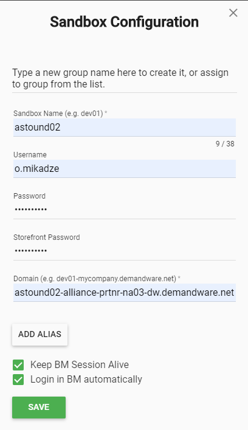
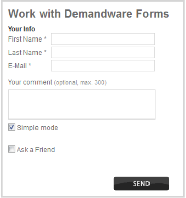
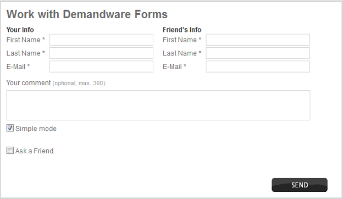
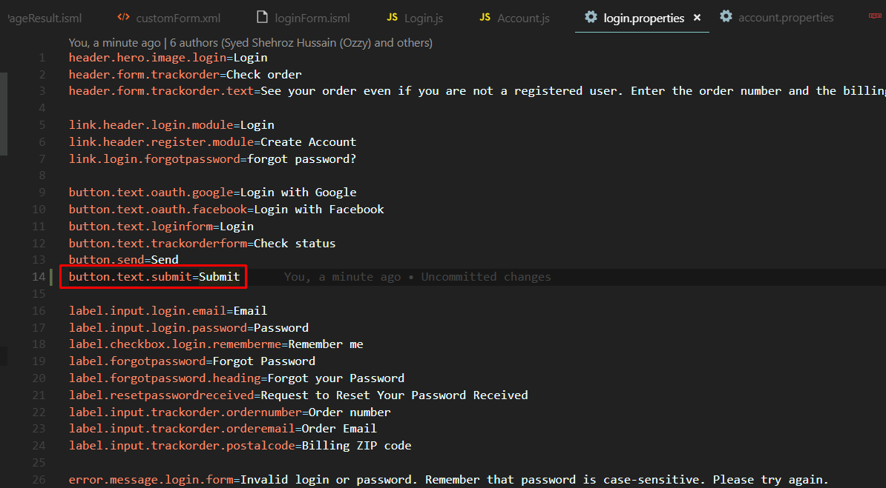

# SFRA Labs

**Table of context:**
- [SFRA Labs](#SFRA-Labs)
  - [Setting Up and Installing SFRA](#Setting-Up-and-Installing-SFRA)
  - [Configure DwithEasy Extension for Chrome](#Configure-DwithEasy-Extension-for-Chrome)
  - [Lab1: Creating the Hello Controller](#Lab1-Creating-the-Hello-Controller)
  - [Lab2: Finding an Error on a Controller](#Lab2-Finding-an-Error-on-a-Controller)
  - [Lab3: SFRA Forms](#Lab3-SFRA-Forms)
      - [Summary](#Summary)
      - [Goals](#Goals)
      - [Requirements](#Requirements)
      - [Sample](#Sample)
  - [Lab3](#Lab3)

## Setting Up and Installing SFRA

The SFRA (Storefront Reference Architecture) reference application provides two sample sites:

- RefArch
- RefArchGlobal

SFRA also provides associated data and code to drive the sample ecommerce storefront.

The SFRA reference application represents Commerce Cloud's current recommended approach for implementing digital storefronts. If you're creating a site, use the SFRA reference application as a starting point.

To get started with SFRA, you have to perform some preliminary steps:

- [Obtain a GitHub account if you don't already have one](https://documentation.b2c.commercecloud.salesforce.com/DOC1/index.jsp?topic=%2Fcom.demandware.dochelp%2FSFRA%2FSFRASetup.html)
- [Build SFRA and push the code to the server](https://documentation.b2c.commercecloud.salesforce.com/DOC1/index.jsp?topic=%2Fcom.demandware.dochelp%2FSFRA%2FBuildingSFRA.html)
- [Uploading Code for SFRA](https://documentation.b2c.commercecloud.salesforce.com/DOC1/index.jsp?topic=/com.demandware.dochelp/SFRA/ConfiguringSFRA.html)
- [Configure SFRA for your instance so that you can see products and catalogs on the sample storefront](https://documentation.b2c.commercecloud.salesforce.com/DOC1/index.jsp?topic=%2Fcom.demandware.dochelp%2FSFRA%2FConfiguringSFRA.html)


After your environment is set up, you can run the SFRA reference application and explore how it is constructed.


## Configure DwithEasy Extension for Chrome

1. Follow this [link](https://forkpoint.com/products/dwithease/) and click "ADD TO GOOGLE CHROME" button to install extension.
2. 
3. 
4. 
5. Fill the form and click Save
   
6. Now you can navigate to your Chrome extnesions, find the DWithEasy logo and work with your sandbox.


## Lab1: Creating the Hello Controller

**1. Create Hello.js controller**

Navigate to your custom cartridge (in my case it's "*app_custom_storefront*") and create *Hello.js* controller.

- *your_cartridge_name/cartridge/controllers/Hello.js*
  
```javascript
'use strict';

var server = require('server');


server.get('Show', function (req, res, next) {
    res.render('hello/helloTemplate');
    next();
});

module.exports = server.exports();
```

**2. Create template helloTemplate.isml**

Navigate to *your_cartridge_name/cartridge/templates/dafault/hello* folder and create helloTemplate.isml file.

- *your_cartridge_name/cartridge/templates/dafault/hello/helloTemplate*

```html
<html>
    <head>
        <title>Hello</title>
    </head>
    <body>
        <h1>Hello World!</h1>
    </body>
</html>
```

**3. Check your endpoint in browser**

Go to *https://your-sandbox-name-dw.demandware.net/on/demandware.store/Sites-RefArch-Site/en_US/Hello-Show* in your browser. And check or it works.
**Do not forget to change url with your sandbox name**

**4. If all works commit and push it to your branch**


## Lab2: Finding an Error on a Controller

If you had any problems in [Lab1](#Lab1-Creating-the-Hello-Controller) you can figure it out in two ways: using the Request Log or the Problem View.

**1. Use the Request Log:**
   1. Using the URL you bookmarked, invoke the Hello controller with a missing start node: *https://your-sandbox-name-dw.demandware.net/on/demandware.store/Sites-RefArch-Site/en_US/Hello-Show*
   2. Verify that an error occurs on the [storefront](https://documentation.b2c.commercecloud.salesforce.com/DOC1/index.jsp?topic=%2Fcom.demandware.dochelp%2FSiteDevelopment%2FViewStorefront.html&cp=0_1_6_8).
   3. Mouse-over the upper-left corner of the page to re-enable [the Storefront Toolkit](https://documentation.b2c.commercecloud.salesforce.com/DOC1/index.jsp?topic=%2Fcom.demandware.dochelp%2FStorefrontToolkit%2FStorefrontToolkit.html&resultof=%22Storefront%22%20%22storefront%22%20%22Toolkit%22%20%22toolkit%22%20).
   4. From the toolkit, select [Request Log](https://documentation.b2c.commercecloud.salesforce.com/DOC1/index.jsp?topic=%2Fcom.demandware.dochelp%2FSTReference%2FRequestlogtool.html&resultof=%22Request%22%20%22request%22%20%22Log%22%20%22log%22%20).
   5. Re-login to Business Manager if required and reopen the request log.
   6. Read the request log to find the error message.
   7. Correct the controller invocation (Hello-World) and refresh the page.
   8. In the browser, retest the Hello-World Controller.
   9. Use the Request Log to determine what error occurs.
   10. Correct the error and retest.


**2. Use the Problem View**
   1. Remove the interaction node from the controller.
   2. Look in the Problems view in the Controller Editor.
   3. Fix the error.
   4. Retest the Hello-World controller to make sure it works.


## Lab3: SFRA Forms

#### Summary

Task is dedicated to establish/improve/increase skills and knowledge of SFRA Forms and related functionality.


#### Goals

- Revise SFRA form's definitions;
- Revise SFRA form's validation;
- Work with form actions and build custom logic;


#### Requirements

1. Create form definition with the following items:

    1. First Name (mandatory, min length: 5, max length: 50)
    2. Last Name (mandatory, min length: 5, max length: 50)
    3. Email (mandatory, min length: 10, max length: 50, add email validation regexp)
    4. Your Comment (it can be a text area)(optional, max length: 300)
    5. Check boxes or radio buttons group which contains following items:
        - simple mode (selected by default)
        - ask a friend (in this mode, please show UI like on the attached picture)

2. Create custom controller with the related to the task logic. It should contains such parts as:
    1. clear form
    2. populate form with value
    3. validate/invalidate form
    4. interaction continue node which leads to the particular logic - according to triggered action
    5. several interaction nodes or dynamic interaction node
    6. particular interaction templates

3. Create error and successful resource messages inside the "resource/" directory in cartridge in order to display them accordingly

4. Generally, the form should be validated on the client side(please add particular min/max length values and regexp for form-item values) as well as on the server side.
Submit different form actions depending on check boxes or radio buttons values and react on triggered action accordingly.
Show error messages if form is invalid as well as successfull message after submission.

5. Actions logic:
a) simple mode - validate form (Client+Server side validation), show messages with details about entered data and finally thankful message for feedback.
b) ask a friend (in this mode, please show UI like on the attached picture) - implement extended validation for all fields and show message that you comment (lastname+first name) has been redirected/posted/shared to your friend (friend's last+first names)





#### Sample

**1. Creating a Form**

First of all you should create a "Form definition" that describes the data you need from the form, the data validation, and the system objects you want to store the data in.

- app_custom_cartrdge/cartridge/forms/default/customForm.xml

```javascript
    <?xml version="1.0"?>
    <form xmlns="http://www.demandware.com/xml/form/2008-04-19">

	    <field formid="firstname" label="Firstname:" type="string" mandatory="true" min-length="5" max-length="50"/>
        <field formid="lastname" label="Lastname:" type="string" mandatory="true" min-length="5" max-length="50" />
	    <field formid="email" label="Email:" type="string" mandatory="true" min-length="10" max-length="50" />
	    <field formid="comment" label="Comment:" type="string" mandatory="true" max-length="300" />

	    <action formid="submit" valid-form="true" />
    </form>
```

The form definition determines the structure of the in-memory form object. The in-memory form object persists data during the session, unless you explicitly clear the data.

In the Storefront Reference Architecture (SFRA), the first step to create a form is to create a JSON object to contain the form data. The server.getForm function uses the form definition to create this object.

Data from the form is accessible in templates using the pdict variable. However, the form is available only if the server.getForm object is passed to the template by the controller.

See also: 
[ Form Definition Elements](https://documentation.b2c.commercecloud.salesforce.com/DOC1/index.jsp?topic=%2Fcom.demandware.dochelp%2FForms%2FFormDefinitionElements.html) and [ What Is a Form Definition](https://documentation.b2c.commercecloud.salesforce.com/DOC1/index.jsp?topic=%2Fcom.demandware.dochelp%2FForms%2FWhatisaformdefinition.html)


**2. Controller to Render the Form**

The controller in this example exposes a Start function that renders an empty form.The Start function sets the actionURL that's used to handle the submit action for the form and creates a JSON object based on the form definition.


- app_custom_cartridge/cartridge/controllers/CustomPage.js
```javascript
    'use strict';

    var server = require('server');
    var URLUtils = require('dw/web/URLUtils');

    server.get('Main', function (req, res, next) {
        var actionUrl = URLUtils.url('CustomPageResult-Show');//sets the route to call for the form submit action
        var customForm = server.forms.getForm('customForm');//creates empty JSON object using the form definition
        customForm.clear();

        res.render('custom/customPage', {
            actionUrl: actionUrl,
            customForm: customForm
        });
        next();
    });

    module.exports = server.exports();
```

See also [Using API Form Classes](https://documentation.b2c.commercecloud.salesforce.com/DOC1/index.jsp?topic=%2Fcom.demandware.dochelp%2FForms%2FUsingapiformclasses.html)


**3. Form Template**

In this example, **customPage.isml** is the empty form rendered for the user and the **customPageresult.isml** shows data entered into the form.

The client-side JavaScript and css files are included using the **assets.js** module.

The form action uses the **actionUrl** property passed to it by the controller.

- app_custom_cartridge/cartridge/templates/default/customPage.isml
```javascript
    <isdecorate template="common/layout/page">

        <form action="${pdict.actionUrl}" class="custom" method="POST">

            <h1>Custom forms page</h1>

            <div class="form-group required">
                <label for="firstname">First Name</label>
                <input type="text" name="firstname" id="firstname" />
            </div>

            <div class="form-group required">
                <label for="lastname">Last Name</label>
                <input type="text" name="lastname" id="lastname"/>
            </div>

            <div class="form-group required">
                <label for="email">Email</label>
                <input type="email" name="email" id="email" />
            </div>

            <div class="form-group required">
                <label for="comment">Comment</label>
                <div><textarea rows="3" cols="38" name="comment" id="comment" type="comment" ></textarea></div>
            </div>

            <div><input type="checkbox" id="checkbox1"/> <label for="checkbox1">Simple Mode</label></div>
            <div><input type="checkbox" id="checkbox2"/> <label for="checkbox2">Ask a friend</label></div>

            <div><button type="submit" class="btn btn-primary">${Resource.msg('button.text.submit', 'login', null)}</button></div>
        </form>
    </isdecorate>
```

Update the **login.properties** file(Ctrl+P to find this file globaly).
Add this line: **button.text.submit=Submit**




**3. Controller to Render Form Results**

After a form is submitted, data from the form is available as part of the **req.form** property. In the following example, the fields entered in the original form is passed to a new template for rendering.


- app_custom_cartridge/cartridge/controllers/customPageResult.js

```javascript
    'use strict';
    var server = require('server');
    var URLUtils = require('dw/web/URLUtils');

    server.post('Show', function (req, res, next) {

        var firstname = req.form.firstname;
        var lastname = req.form.lastname;
        var email = req.form.email;
        var comment = req.form.comment;

        res.render('custom/customPageResult', {
        firstname: firstname,
        lastname: lastname,
        email: email,
        comment: comment
        });

        next();
    });

    module.exports = server.exports();
```

**4. Form Result Template**
This template prints the form field label and data stored from the form.

- app_custom_cartridge/cartridge/templates/default/customPageResult.isml

```html
    <iscontent type="text/html" charset="UTF-8" compact="true" />
    <html>
        <body>
            <h1>Hello World from CustomForm</h1>
            <p>Nice to meet you, ${pdict.lastname}, ${pdict.firstname}. <br/> Check your email. Is it ${pdict.email}.<br/> Actually you've said that: ${pdict.comment}</p>
        </body>
    </html>
```


## Lab3
